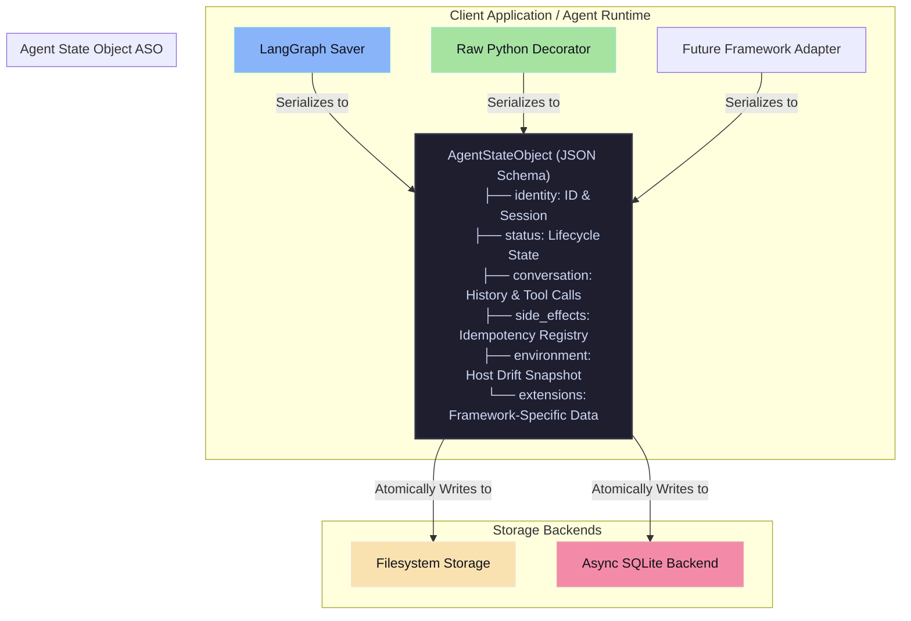

# Agent POSIX

[](https://github.com/kishore-1404/agent-posix/actions/workflows/python-compatibility.yml)
[](https://opensource.org/licenses/MIT)
[](#maturity)

> **The POSIX Standard for AI Agents.** A portable, framework-neutral state serialization format and lifecycle protocol for checkpointing and resuming LLM agents.

---

## Why Agent POSIX?

Modern AI agents are often bound to specific frameworks (like LangGraph, CrewAI, or Autogen) or run in-memory with opaque state. This creates significant problems:
1. **Vendor Lock-in:** Migrating an active agent session from one framework to another is practically impossible.
2. **Fragility & Cost:** A process crash mid-run means losing execution context, forcing you to re-run expensive LLM api calls and duplicate side-effects (like duplicate database writes or duplicate API calls).
3. **Black-box Debugging:** When a production agent gets stuck in a loop, developers cannot easily download, inspect, patch, and resume the live execution state locally.

**Agent POSIX** solves this by establishing a portable **Agent State Object (ASO)** format and standard **Freeze/Resume** lifecycle protocol.



---

## Capabilities

- 📦 **Framework-Neutral ASO Schema:** Built with Pydantic v2. Fully serializable, deterministic, and documented via standard JSON Schema.
- ❄️ **Freeze & Resume Lifecycle Protocol:** State-machine validated transitions (`INITIALIZING` -> `RUNNING` -> `CHECKPOINTED` -> `RESUMING`).
- 🛡️ **Host Drift Detection:** Captures active platform version, execution folder, and tracked files to prevent resuming state under incompatible host conditions.
- 🔧 **Side-Effect Idempotency Decorator:** Wrap external APIs or tools with `@checkpoint_boundary` to record side effects and automatically replay cached responses upon resume, preventing double execution and duplicate API billing.
- 📂 **High-Durability Storage Backends:**
  - **Filesystem:** Atomic replace-on-write writes (flush, `fsync` file, and `fsync` parent directory) with session-level file locks.
  - **SQLite:** WAL-mode async checkpoint database.
- 🔌 **LangGraph Adapter:** Seamlessly swap native savers with `ASOLangGraphSaver` to checkpoint LangGraph threads into portable ASOs.
- 🛠️ **Developer CLI:** Interactive terminal interface to inspect, manually freeze, or resume sessions.

---

## Comparison: Where Does It Fit?

| Feature | Standard JSON Serialization | Native Checkpoint Savers (LangGraph Postgres) | Event Sourcing / Temporal | **Agent POSIX** |
| :--- | :---: | :---: | :---: | :---: |
| **Framework Portability** | ⚠️ Custom Parser Needed | ❌ No (proprietary format) | ❌ Complex integration | **Yes (ASO Standard)** |
| **Crash Recovery** | ❌ No | ✅ Yes (in-memory/DB) | ✅ Yes | **Yes (Atomic Filesystem/SQLite)** |
| **Side-Effect Replay** | ❌ No | ⚠️ Framework-dependent | ✅ Yes | **Yes (Simple `@checkpoint_boundary` Decorator)** |
| **Environment Drift Check** | ❌ No | ❌ No | ❌ No | **Yes (Fatal/Advisory Drift Check)** |
| **CLI Inspection** | ❌ No | ❌ No | ⚠️ Complex dashboard | **Yes (Rich Visual CLI)** |

---

## Use Cases

### 1. Framework Migrations
Design your agent in LangGraph for easy visualization. Once ready, port the active checkpoint state into a raw python runtime using Agent POSIX's standard mappings without losing active conversation states.

### 2. Interrupted Session Recovery
Run long-running multi-agent pipelines (e.g. data mining, codebase refactoring) overnight. If the process crashes due to network interruption, resume it from the last checkpoint. Only unexecuted steps will run, saving you from duplicate API costs.

### 3. Production Debugging & Local Replay
A production agent gets stuck in a loop.
1. Download the ASO JSON checkpoint from production storage.
2. Run `agentposix inspect <session_id>` to locate the stuck execution node and side-effects.
3. Patch the JSON file locally.
4. Run `agentposix resume <session_id>` locally to step through the failure and verify the fix.

---

## Installation

Install from this package directory:

```bash
python3 -m venv .venv
source .venv/bin/activate
pip install -e ".[adapters,storage,dev]"
```

### Installation Extras
- `[adapters]`: Enables LangGraph and LangChain Core integration.
- `[storage]`: Enables SQLite asynchronous storage.
- `[dev]`: Dev tools (pytest, ruff, mkdocs).

---

## Quickstart: Side-Effect Replay

Save this snippet as `demo.py` and run it:

```python
import tempfile
from agentposix import AgentStateObject, FilesystemBackend, freeze, resume, checkpoint_boundary
from agentposix.enums import FreezeTriggerReasonEnum, ParadigmEnum, ASOStatus
from agentposix.models.metadata import IdentityBlock, ModelConfig, FreezeMetadata
from agentposix.models.execution_pointer import ExecutionPointer
from agentposix.models.message import ConversationHistory
from agentposix.models.side_effect import SideEffectRegistry
from agentposix.models.environment import EnvironmentSnapshot

with tempfile.TemporaryDirectory() as tmpdir:
    storage = FilesystemBackend(tmpdir)
    session_id = "session-1"

    # Define a mock side-effect function representing an LLM or database call
    @checkpoint_boundary(session_id=session_id, storage=storage)
    def fetch_weather(location: str):
        print(f"--> [REAL EXECUTION] Fetching weather for {location}...")
        return {"location": location, "temperature": "22C"}

    # Initialize a new Agent State Object
    aso = AgentStateObject(
        identity=IdentityBlock(aso_id="aso-1", session_id=session_id),
        status=ASOStatus.INITIALIZING,
        created_at="2026-05-25T00:00:00Z",
        model_config_block=ModelConfig(provider="example", model_id="agent-model"),
        conversation=ConversationHistory(),
        execution_pointer=ExecutionPointer(paradigm=ParadigmEnum.CUSTOM),
        side_effects=SideEffectRegistry(),
        environment=EnvironmentSnapshot(cwd=".", python_version="3.10.0", platform="linux"),
        metadata=FreezeMetadata(
            framework_name="raw",
            framework_version="1",
            trigger_reason=FreezeTriggerReasonEnum.EXPLICIT_CALL,
        ),
    )

    # First Run (Executes the real function and saves it)
    print("\n--- FIRST RUN ---")
    fetch_weather("Berlin")
    freeze(aso, storage, summary="Step 1 complete")

    # Second Run (Resumes the session and fetches the weather again)
    print("\n--- SECOND RUN (RESUMING) ---")
    resumed_aso = resume(session_id, storage)
    
    # This call is skipped! It replays the cached result from side-effects registry.
    result = fetch_weather("Berlin")
    print(f"Replayed Result: {result}")
```

---

## Interactive Command Line (CLI)

Agent POSIX exposes a terminal CLI for inspection and diagnostics:

```bash
# 1. Inspect a stored session structure, node pointer, and recorded side-effects
agentposix inspect session-1 --path .agentposix

# 2. Dry-run resume, showing environment advisories or drift errors
agentposix resume session-1 --path .agentposix

# 3. Manually patch and freeze a JSON payload (useful for debugging)
agentposix freeze --input debug_payload.json --path .agentposix --summary "patched manually"
```

---

## Documentation and Deep Dives

For further reading and concepts, explore the following documentation pages:

- **Architecture:** [docs/concepts/architecture.md](docs/concepts/architecture.md)
- **Python API Reference:** [docs/api-reference/python-api.md](docs/api-reference/python-api.md)
- **CLI Reference:** [docs/api-reference/cli.md](docs/api-reference/cli.md)
- **Storage Backends (Filesystem vs SQLite):** [docs/concepts/storage-backends.md](docs/concepts/storage-backends.md)
- **Troubleshooting:** [docs/concepts/troubleshooting.md](docs/concepts/troubleshooting.md)
- **Adapter Extension Contract:** [docs/adapters/extension-contract.md](docs/adapters/extension-contract.md)
- **Dependency Management Policy:** [docs/concepts/dependency-policy.md](docs/concepts/dependency-policy.md)
- **Alpha Release Criteria:** [docs/release/alpha-criteria.md](docs/release/alpha-criteria.md)
- **Release Checklist:** [docs/release/v0.1.0-alpha-checklist.md](docs/release/v0.1.0-alpha-checklist.md)

---

## License

This project is licensed under the terms of the MIT license. See [LICENSE](LICENSE) for details.
